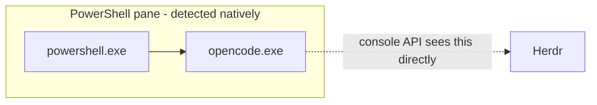
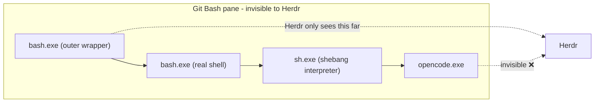
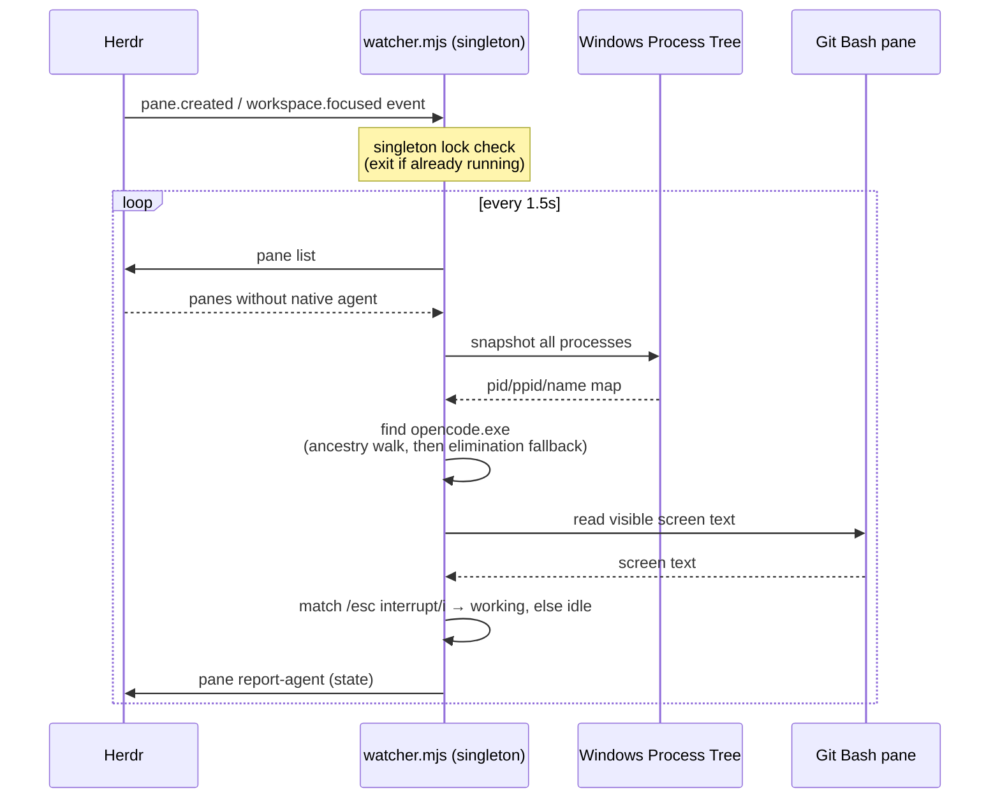
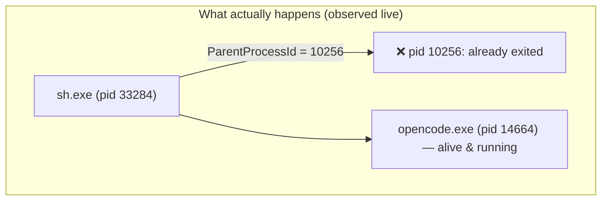

# Herdr Git Bash Agent Detector

A [Herdr](https://herdr.dev) plugin that detects `opencode` sessions running inside **Git Bash** panes on Windows and reports their state (`idle` / `working`) back to Herdr in real time — filling a gap in Herdr's own native agent detection.

## The problem

Herdr detects which agent is running in a pane (and whether it's idle, working, or blocked) using Windows' own process/console APIs. That works perfectly when a pane's shell is **PowerShell**:



It silently fails when a pane's shell is **Git Bash**. MSYS/Git-for-Windows spawns an outer wrapper, an inner real shell, and (for scripts with a `#!/bin/sh` shebang) an extra `sh.exe` interpreter hop — and Windows' console-process enumeration never sees past the first one:



Result: opencode running in a Git Bash pane never shows up as a detected agent — no idle/working indicator, no status in the sidebar.

## The fix

This plugin runs a small persistent watcher, installed via Herdr's plugin system (`[[events]]` hooks + the `herdr` CLI), that:

1. Finds panes Herdr's native detection has **not** claimed (`agent` field absent).
2. Checks if that pane's shell is `bash.exe` / `sh.exe` (a Git Bash candidate).
3. Finds the real `opencode.exe` process using the actual Windows process tree (via WMI), not the console API Herdr is limited by.
4. Reads the pane's visible screen text for a state marker (`esc interrupt` = working) to distinguish idle vs. working.
5. Reports state via `herdr pane report-agent` / `release-agent` — the same API a first-class integration would use.



### Why "elimination matching" exists

The ancestry walk (step 3 above) is the obvious approach, and it *sometimes* works. But MSYS's fork/exec emulation on Windows can leave an intermediate process (typically the `sh.exe` shebang interpreter, but observed on other hops too) with a **stale `ParentProcessId` pointing at an already-exited PID**. Windows does not reparent orphans, so re-deriving the chain later silently "loses" a process that is still very much alive.



To handle this robustly, the watcher **memoizes** the `opencode.exe` pid once discovered (never re-derives ancestry for a pane it already matched), and falls back to **elimination matching**: if exactly one Git Bash pane is still unmatched and exactly one `opencode.exe` process has newly appeared system-wide since the last poll tick (never seen before — so it can't be an unrelated pre-existing session), assign it directly.

## Files

```
herdr-gitbash-agent-detector/
├── herdr-plugin.toml     # plugin manifest — event hooks
├── watcher.mjs           # main persistent singleton watcher
└── lib/
    ├── herdrcli.mjs      # thin wrapper around the herdr CLI (reliable, no retry needed)
    ├── proctree.mjs      # WMI-based process tree snapshot + ancestry walk
    └── pipe.mjs           # raw named-pipe events.subscribe client (proof-of-concept
                           # only — not used by watcher.mjs; kept for reference, see below)
```

`lib/pipe.mjs` was built and proven working during initial research (real-time push events over Herdr's raw Windows named pipe API), but the shipped watcher deliberately avoids it — see [Design notes](#design-notes) below.

## Installation

```bash
herdr plugin link "C:\path\to\herdr-gitbash-agent-detector"
```

Two event hooks bootstrap the singleton watcher:

| Event | Why |
|---|---|
| `pane.created` | Fires for genuinely new panes created during the current Herdr session. |
| `workspace.focused` | `pane.created` does **not** fire for panes *restored* from a previous session on Herdr restart — `workspace.focused` reliably fires as Herdr restores focus state, so this is the bootstrap path for "restart Herdr with a Git Bash pane already open." |

Both hooks spawn the same `watcher.mjs`; a pid-lock file (in `HERDR_PLUGIN_STATE_DIR`) ensures only one instance actually runs — every other firing spawns a throwaway process that detects the lock and exits immediately (confirmed empirically to add negligible overhead).

Verify it's running:

```bash
herdr plugin log list --plugin custom.gitbash-agent-detector
herdr agent list
```

## Design notes

- **Why not raw socket `events.subscribe` for everything?** It was proven to work (see `lib/pipe.mjs`), including real-time push events. But Herdr's Windows named-pipe accept loop races the previous connection's teardown on the first write of a fresh connection — connections need a retry-until-ack loop to reliably get through. On top of that, idle-state detection can't be represented as an "event matched" push anyway (idle is an *absence* of change, not a new event). Polling via the `herdr` CLI (proven 100% reliable all session, no retry ever needed) achieves the same real-world responsiveness with far less fragility.
- **Why 1.5s poll interval?** Balance between responsiveness and spawning a PowerShell process (WMI query) too often. Tune `POLL_INTERVAL_MS` in `watcher.mjs` if needed.
- **Why regex on screen text instead of a proper opencode integration hook?** Herdr's first-class `opencode` integration (`herdr-agent-state.js`, a real opencode plugin using lifecycle hooks + the socket API) is **not supported on Windows** (`herdr integration install opencode` → `opencode integration is not supported on Windows`). This plugin is the workaround.

## Known limitations

- **`blocked` state not implemented.** Only `idle`/`working` are detected. No permission-prompt screen text has been captured yet to build a reliable regex — straightforward to add once you hit a real prompt and can share the screen text.
- **Elimination matching assumes ~one opencode launch at a time system-wide.** If you start opencode in two different, previously-untracked Git Bash panes within the same ~1.5s poll window, attribution could be ambiguous. Not the common workflow, but worth knowing.
- **Windows only.** `platforms = ["windows"]` in the manifest; PowerShell/cmd panes don't need this plugin at all (Herdr detects them natively).
